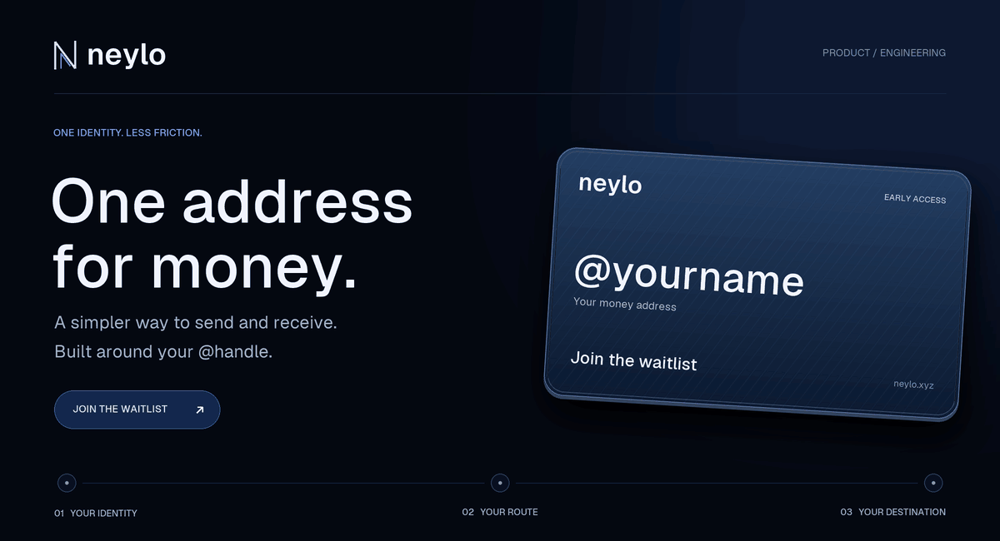
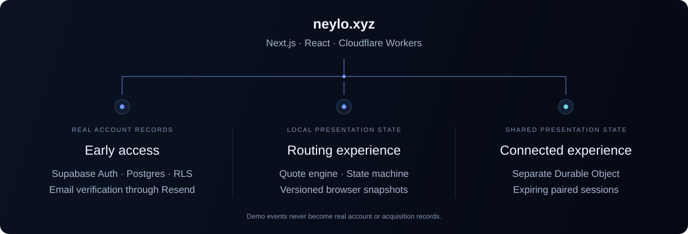

<p align="center">
  <a href="https://neylo.xyz">
    
  </a>
</p>

<p align="center">
  <strong>Your name. Your money address.</strong><br />
  Reserve your @handle. Explore a more considered way to move money.
</p>

<p align="center">
  <a href="https://neylo.xyz"><strong>Join the waitlist ↗</strong></a>&nbsp;&nbsp; · &nbsp;&nbsp;
  <a href="https://neylo.xyz/app/demo">Try the product</a>&nbsp;&nbsp; · &nbsp;&nbsp;
  <a href="https://neylo.xyz/pitch">Explore the pitch</a>&nbsp;&nbsp; · &nbsp;&nbsp;
  <a href="docs/assets/neylo-hero.png">Still artwork</a>
</p>

---

### 80 waitlist participants in one day.

**Launch day · 12 September 2026 · UTC**

Recorded completed accounts, excluding staff, tests and unfinished attempts. The total includes **10 signups verified through NEYLO** and **70 previously verified participants imported with the operator’s attestation**. Counts were checked against production records on 13 September 2026; imported completion times retain their supplied provenance. [Current aggregate counts →](https://neylo.xyz/pitch) · [How imports are recorded →](docs/account-imports.md)

---

### A product you can use.

NEYLO starts with a personal money address: **@you**. The working early-access product pairs that identity with passwordless accounts, persistent handle reservations and invitations. Its interactive payment experience explores what comes next: selecting a person, choosing a route and following one continuous journey to arrival.

| Start here | What you can do |
| :--- | :--- |
| **[The waitlist ↗](https://neylo.xyz)** | Type a handle onto your sapphire identity card, verify your email and reserve your identity. |
| **[The routing experience ↗](https://neylo.xyz/app/demo)** | Compare calculated routes, change cost or speed preferences, unfold the journey and inspect the receipt. |
| **[Nadin ↗](https://neylo.xyz/demo/nadin) · [Kerim ↗](https://neylo.xyz/demo/kerim)** | Pair two browser sessions and watch the same transfer progress between both participants. |
| **[The pitch ↗](https://neylo.xyz/pitch)** | Explore the product story, working experiences and current aggregate signup counts. |

For the connected experience, open **Nadin → Connect the two pages**, then open its pairing link or scan the QR on the second device. Both screens share the same isolated session. [Presentation guide →](docs/connected-demo.md)

**Execution boundary:** accounts and waitlist records are real. Financial execution in the product experiences is simulated; bank and payment-provider integrations are not connected. Demo activity stays separate from real account and acquisition records.

### Small details. Deliberate engineering.

- **An identity that responds.** A real DOM card, immediate handle preview, restrained depth, pointer tilt and reduced-motion support.
- **One continuous journey.** Persistent recipient, amount, selected route and reference. Shared nodes unfold into tracking without replacing the app.
- **Numbers that reconcile.** Integer minor units, explicit rounding, centralized fixture fees and FX, and route ranking by actual calculations.
- **State that survives.** Guarded transitions, deduplicated confirmation, ordered events, interruption recovery and versioned demo storage.
- **A clear boundary around real data.** Postgres transactions protect reservations; managed authentication protects accounts; operator and presenter access are distinct.

### Inside the system.



| Layer | Implementation |
| :--- | :--- |
| Interface | Next.js App Router, React, TypeScript, Geist, Motion |
| Application runtime | Cloudflare Workers through the vinext adapter |
| Identity and persistence | Supabase email OTP, Postgres, constraints, transactions and RLS |
| Transactional email | Resend SMTP on the verified NEYLO sending domain |
| Connected presentation | A separate Cloudflare Durable Object with expiring paired sessions |
| Validation | Authenticated aggregates and CSV; registered emails restricted to the operator |

<details>
<summary><strong>Repository map</strong></summary>

```text
src/app/                  Routes, metadata and API handlers
src/features/signup/      Waitlist and email-code completion
src/features/card/        Interactive sapphire identity
src/features/account/     Persistent account and invitations
src/features/admin/       Private validation and operations
src/features/demo/        Quotes, state machine and route journey
src/features/demo/shared/ Paired participant experience
src/features/pitch/       Presentation and aggregate metrics
src/core/                 Authentication, configuration and security
supabase/migrations/      Ordered database changes
tests/                    Unit and isolated database verification
ops/                      Build, deployment and operational tools
docs/                     Architecture, boundaries and test evidence
```

</details>

### Run it locally.

**Node.js 22+ · npm · Docker Desktop**

```sh
npm ci
npx supabase start
npx supabase status --output json > .env.local-status.json
npx tsx ops/prepare-local.ts
npm run dev
```

Open **[localhost:3100](http://127.0.0.1:3100)**. Local verification emails appear in **[Mailpit](http://127.0.0.1:55424)**. Supabase runs on port `55421`; Postgres uses `55422`.

The setup helper creates ignored local configuration and refuses to modify a database with completed accounts. Use local credentials for development; [`.env.example`](.env.example) documents the required fields. The connected demo needs the Cloudflare runtime; see its [local setup](docs/connected-demo.md).

### Verify. Build. Ship.

```sh
npm run check              # TypeScript + 43 tests
npm run test:db            # Resets the isolated local database fixture
npm run build:production   # Builds for the configured production backend
npm run deploy:vinext      # Builds and deploys through authenticated Wrangler
```

The current checks cover input validation, money calculations, routing, state recovery, shared sessions, metric boundaries and waitlist closure. Database verification additionally exercises transactions, concurrency, permissions and accounting invariants. Historical browser coverage and its device limitations are recorded in the guides below.

Production builds require the authorized machine’s ignored configuration. Deployment uses the existing Cloudflare project and domain; migrations are applied separately. The vinext adapter is beta, so keep the lockfile pinned and check the production route and referenced assets after deployment. GitHub Actions validates source; it does not automatically deploy.

---

<p align="center">
  <a href="docs/architecture.md">Architecture</a>&nbsp; · &nbsp;
  <a href="docs/operations.md">Operations</a>&nbsp; · &nbsp;
  <a href="docs/verification.md">Verification</a>&nbsp; · &nbsp;
  <a href="docs/product-demo.md">Product experience</a>&nbsp; · &nbsp;
  <a href="docs/waitlist-transition.md">Waitlist release</a>
</p>

<p align="center">
  <sub>Designed and built for NEYLO · Operated by Horalix d.o.o. · Sarajevo, Bosnia and Herzegovina</sub><br />
  <a href="https://neylo.xyz"><strong>One address for money.</strong></a>
</p>
