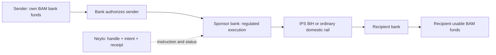
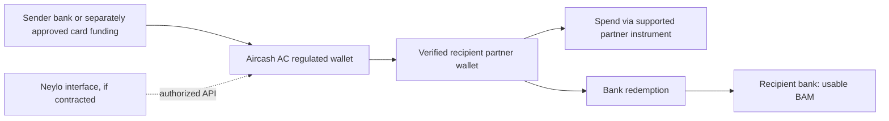
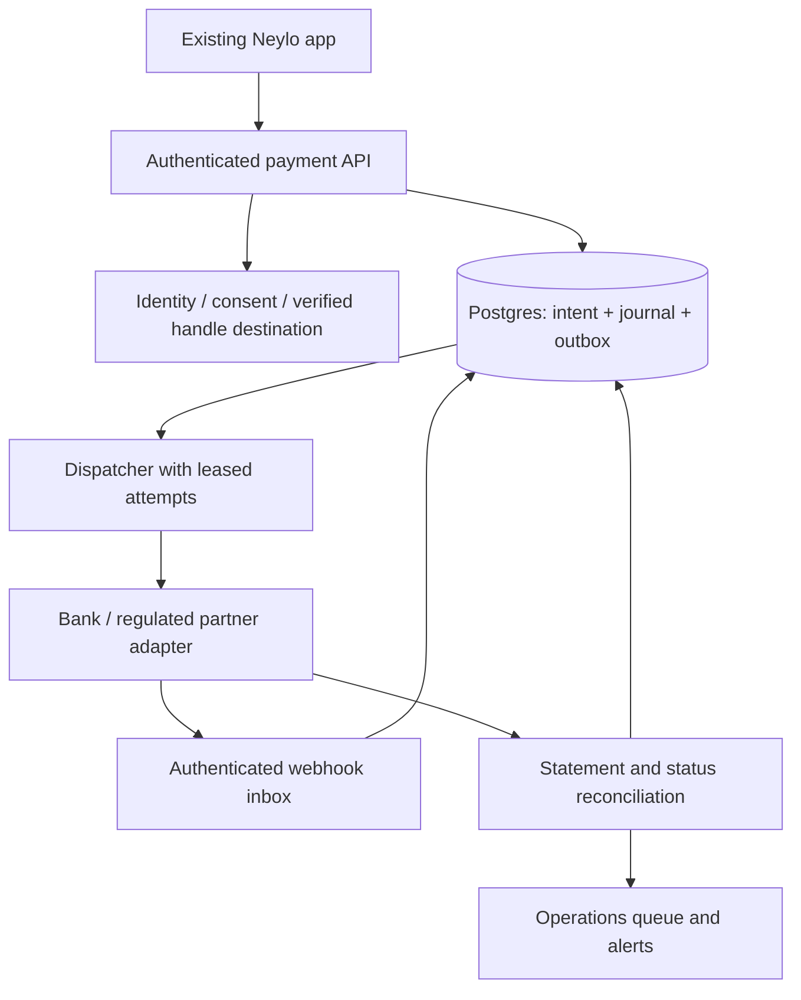

# Neylo: Bosnia-first payment launch decision

Research and repository inspection: **23 September 2026**. Base commit: **d27411dbdefead2caf99d69221298022c52f699e**. Implementation branch: `codex/bam-payment-sandbox`.

## Decision

**Pursue one Bosnian sponsor bank for a bank-funded, BAM-denominated P2P pilot. Approach Intesa Sanpaolo Banka BiH first, and qualify Raiffeisen concurrently as an alternative sponsor.** Neylo provides the handle directory, transfer intent, receipt and support experience; the bank provides the regulated service, customer authentication/authorization, custody and execution. This is a recommended commercial structure, **not an approved partnership**.

Start with adult, banked friends and families paying back **10–100 BAM**. Limit the initial sending population to customers the sponsor can onboard and authorize. Recipients should receive spendable BAM in their own bank account. Do not require recipient installation when the approved bank flow can deliver directly to a verified bank destination.

**Fallback: negotiate an Aircash AC partnership for a partner-held BAM wallet and transfers, with redemption explicitly included.** Proceed only if Aircash authorizes Neylo's specific P2P interface and both funding and recipient access. Its merchant API or consumer product alone is insufficient. If neither partner agrees, launch payment requests and bank-transfer instructions only; do not collect funds into Neylo's operating account or represent that utility as an executed-payment app.

The first release should have one route, one currency and truthful status. Defer card funding, FX, crypto, issued cards, merchant acquiring and utility aggregation. There is no verified off-the-shelf provider in this research that has approved the complete Neylo business model for a Bosnia-based company, Bosnian residents and domestic BAM endpoints.

**Assumptions:** a Bosnia-based operating company; adults only; domestic P2P first; no existing financial license or signed payment-provider agreement; no production payment credentials. Repository operator defaults mention Horalix, but incorporation, ownership and regulated status were not independently established. No earlier research documents were provided; existing demo routes were revalidated as hypotheses.

Evidence labels throughout: **V** = verified in inspected source/code, with its scope; **I** = inference/recommendation; **E** = explicit planning estimate; **C** = needs written provider/regulatory confirmation. Public product availability never implies commercial approval for Neylo.

## What exists in the repository

File links below are pinned to the inspected commit; production records and infrastructure were not independently accessed.

| Area | Evidence and finding | Decision |
|---|---|---|
| Application | [package.json](https://github.com/Kerim-Sabic/neyloapps/blob/d27411dbdefead2caf99d69221298022c52f699e/package.json): Next 16.3.5, React 19.3.0, TypeScript 7.0.2, Zod, SWR, Motion; npm lockfile. | Keep product UI and TypeScript. No justified rewrite. |
| Runtime | [worker.ts](https://github.com/Kerim-Sabic/neyloapps/blob/d27411dbdefead2caf99d69221298022c52f699e/worker.ts), [vite.config.ts](https://github.com/Kerim-Sabic/neyloapps/blob/d27411dbdefead2caf99d69221298022c52f699e/vite.config.ts), [wrangler.jsonc](https://github.com/Kerim-Sabic/neyloapps/blob/d27411dbdefead2caf99d69221298022c52f699e/wrangler.jsonc): Cloudflare via beta vinext, explicit assets, no-store responses, demo Durable Objects. Native Next config also exists. | Preserve the public app. Qualify adapter behavior and failover before exposing payment APIs; do not run two financial backends. |
| Authentication | [supabase.ts](https://github.com/Kerim-Sabic/neyloapps/blob/d27411dbdefead2caf99d69221298022c52f699e/src/core/supabase.ts), [signup/service.ts](https://github.com/Kerim-Sabic/neyloapps/blob/d27411dbdefead2caf99d69221298022c52f699e/src/features/signup/service.ts): email OTP, fresh getUser checks, pending-token binding, HttpOnly cookies, rate limits. | Keep for account access. Email verification is not KYC, bank-account ownership, or payment authorization. Add partner onboarding and step-up authorization. |
| Data | Nine SQL migrations; [core.sql](https://github.com/Kerim-Sabic/neyloapps/blob/d27411dbdefead2caf99d69221298022c52f699e/supabase/migrations/202609120001_core.sql) defines RLS, explicit grants, immutable promotion entries and audit records. Signup finalization uses server-only RPC and database coordination. | Keep identities, handles, consent and promotion history. Add a separate financial domain. Do not repurpose promotional credit entries as deposits. |
| Actual product | [README](https://github.com/Kerim-Sabic/neyloapps/blob/d27411dbdefead2caf99d69221298022c52f699e/README.md), account/admin/signup services: waitlist, reservations, invitation and campaign accounting, account preferences, deletion requests, operator reports. README reports 80 launch-day participants, including 70 imports. | Repository-reported traction, not independently verified current active/payment users. Pilot consent and renewed payment terms required. |
| Payments | [demo/config.ts](https://github.com/Kerim-Sabic/neyloapps/blob/d27411dbdefead2caf99d69221298022c52f699e/src/features/demo/config.ts) explicitly calls fees/FX hackathon fixtures; [simulation.ts](https://github.com/Kerim-Sabic/neyloapps/blob/d27411dbdefead2caf99d69221298022c52f699e/src/features/demo/simulation.ts) completes on a clock; [room-worker.ts](https://github.com/Kerim-Sabic/neyloapps/blob/d27411dbdefead2caf99d69221298022c52f699e/src/features/demo/shared/room-worker.ts) is a separate presentation system. | No connected collection, payout, KYC, bank balance, financial reconciliation or real-money ledger found. Preserve demos with visible simulation labels; replace execution semantics for payments. |
| Controls | [security.ts](https://github.com/Kerim-Sabic/neyloapps/blob/d27411dbdefead2caf99d69221298022c52f699e/src/core/security.ts): origin validation, HMAC rate-limit identifiers and recent-auth cookie; [security-headers.ts](https://github.com/Kerim-Sabic/neyloapps/blob/d27411dbdefead2caf99d69221298022c52f699e/src/security-headers.ts): CSP, HSTS and frame restrictions. | Useful baseline. Current CSP/payment permission is incompatible with simply dropping in a hosted card widget; use provider-specific approved origins and nonce-based scripts when that phase arrives. |
| Tests / delivery | [CI](https://github.com/Kerim-Sabic/neyloapps/blob/d27411dbdefead2caf99d69221298022c52f699e/.github/workflows): npm install, route type generation, typecheck and unit suite. Local database/concurrency tests and browser scripts also exist. | Baseline **46 tests passed**; native type generation and typecheck passed. Production dependency audit reported zero known advisories on inspection date; this is not a penetration test. Standalone PostgreSQL suite requires a separate local service and was not run. |

**Payment launch blockers, rather than invented defects:** no money execution; time-based demo success would be unsafe if reused; no payment authorization or KYC; no financial operational console; no recipient destination verification; no settlement accounting. The shared demo's public room is intentionally public and must never carry personal or financial data. The existing service key can bypass RLS: new financial tables need restricted database roles/procedures, not reliance on RLS alone. Supabase security-definer RPCs currently live in `public` with grants restricted; new privileged financial procedures should live in an unexposed schema and keep a fixed search path.

## Infrastructure: what IPS means and what is live

**V:** CBBH announced the domestic launch on **20 July 2026**. This supersedes earlier statements that TIPS Clone was merely planned. It does not establish live cross-border SEPA access. [CBBH launch notice](https://www.cbbh.ba/press/ShowNews/1798?lang=bs).

**V:** IPS means **Instant Payment System** here. The July 2026 rules specify BAM, a **5,000 BAM** transaction cap, up to **10 seconds** for transfer/settlement/recipient availability, and 24/7 operation. Direct participation is for banks/CBBH; other authorized payment providers participate indirectly. Indirect participation still requires payment-service authorization, ESMIG connectivity, testing, acceptance of rules, a liquidity agreement with a direct bank and CBBH participant status. Sponsor liquidity replenishment depends on RTGS operating hours. Neylo acting as the bank's technology provider is a different contractual model from Neylo becoming an indirect participant. [Official IPS rules, Articles 3–6, 8, 12–13](https://www.sllist.ba/page/akt/ohz4nh78h77o8FKfOhmrI=).

The CBBH IPS page labels its participant document **9 September 2026**; the linked PDF retrieved on this research date lists **seven** banks. The PDF does not give individual activation dates; do not infer them from the page label. [CBBH directory](https://www.cbbh.ba/Content/Read/1291?lang=bs), [participant PDF](https://www.cbbh.ba/content/DownloadAttachment/?id=d0a211e1-9d5f-4a56-99b1-4ba00225c544&langTag=bs).

| Listed participant | BIC | What is established / unresolved |
|---|---|---|
| Intesa Sanpaolo banka BiH | UPBKBA22XXX | Its 27 July notice confirms customer instant payments through digital channels, conditional on recipient-bank participation. Strongest first sponsor lead. |
| Raiffeisen Bank BiH | RZBABA2SXXX | Listed and named at launch. Neylo/API access, sender channels and tariff require confirmation. |
| Sparkasse Bank BiH | ABSBBA22XXX | 22 July notice confirmed receiving; outbound digital service was being prepared then. Current outbound activation needs confirmation. |
| Nova banka, Banja Luka | NOBIBA22XXX | Listed; confirm sending, receiving, API/file channel, cutoffs and sponsor appetite. |
| ATOS bank, Banja Luka | SABRBA2BXXX | Listed; CBBH separately announced joining on 17 August. Confirm customer channels. |
| NLB Banka a.d. Banja Luka | RAZBBA22XXX | Listed. Do not conflate with NLB Banka Sarajevo. Confirm channels. |
| ZiraatBank BH | TZBBBA22XXX | Listed in retrieved PDF; confirm activation date and customer channels. |

Bank sources: [Intesa, 27 July 2026](https://intesasanpaolobanka.ba/stanovnistvo/ko-smo-mi/novosti/instant-placanje-obavijest.html), [Sparkasse, 22 July 2026](https://www.sparkasse.ba/bs/press/informacije-za-medije/2026/07/22/sparkasse-banka-me-u-prve-tri-banke-u-bih-u-sistemu-instant-pla-anja-centralne-banke-bih), [ATOS joining notice](https://www.cbbh.ba/press/ShowNews/1810?lang=bs). Reports with three or six banks should not override the retrieved primary list. Actual pairwise Neylo reach remains **C**, to be proven by partner certification and an explicitly approved pilot.

Ordinary domestic transfers remain essential for non-IPS destinations. CBBH distinguishes giro clearing up to 10,000 BAM from RTGS, which also supports smaller amounts. BBI publishes business-day clearing cycles and customer cutoffs. Neither is an assurance of 24/7 recipient availability. [CBBH systems](https://www.cbbh.ba/content/read/792), [BBI domestic transfers](https://bbi.ba/en/legal-entities/payment-transactions/payment-transactions/in-the-country/).

Do not confuse IPS BiH with Serbia's RSD IPS system, a processor's gateway branding, Halcom software, or KVIKO's own participating-bank network.

## Provider and route comparison

For **all uncontracted routes**, Neylo-specific approval, price, minimum volume, monthly minimum, reserve, collateral, termination conditions and approval duration remain **C**. No approval timeline or provider fee is assumed below.

| Route | Entity / residents / currency / endpoints | Collection vs disbursement and use case | Decision and dependencies |
|---|---|---|---|
| **Sponsor bank + IPS / ordinary BAM** | **V:** domestic banks and BAM rail. **C:** Bosnia company as technology vendor/agent, territorial permissions, customer onboarding model and access to sender accounts. | **V:** customer credit transfers. **C:** Neylo-initiated P2P API or bank-hosted authorization; customer funds must remain under bank control. Receiving-bank reach broader than sender integration. | **Primary.** Best domestic economics hypothesis; low–medium integration effort after access. A bank sponsorship contract is not a retail account. Confirm reports, recalls and recipient-credit evidence. |
| **Aircash AC, BiH** | **V:** listed by ABRS as an e-money issuer; local terms identify the local issuer and its approval. **C:** Neylo contract, residence/territory scope, BAM partner API and every endpoint. | **V:** local wallet terms cover P2P, merchant payments and bank payments. **C:** embedded/white-label P2P, incoming-card and outgoing-bank capabilities, sender/recipient KYC and settlement. | **Fallback.** Potentially one partner before individual bank APIs; competing consumer app and margin/UX dependency. Do not build on a merchant contract disguised as P2P. |
| **Bamcard / KVIKO + bank** | **V:** local phone-based P2P and cardless cash product; published app identifies ASA, BBI and Union ecosystem. **C:** current bank/product availability and Neylo access. | Account-to-account registered users; cardless code can reach a nonregistered cash recipient. This is not universal Visa/Mastercard card funding. | Credible local discovery lead, but narrower network and commercial white-label access unverified. May outperform a new wallet if bank onboarding fits. |
| **Halcom HalConnect** | **V:** BiH corporate integration; published support claims 14 banks. That is not a current IPS coverage list. | SOAP submission, statements and order status from a business application. **C:** approval to operate partner/customer-money accounts, delegated signing and IPS exposure. | Potential transport for sponsor-approved settlement/reconciliation before bespoke bank APIs. Not a license, consumer open banking, or custody provider. |
| **Monri / Payten + acquirer** | **V:** BiH card-acquiring ecosystem and local presence. **C:** entity underwriting, BAM settlement and card BIN coverage for money transfer. | Hosted/tokenized merchant card acceptance exists. **C:** specific account-funding/P2P approval and a separate payout rail. Merchant refunds do not constitute payouts to friends. | Good later merchant checkout candidate. Card-funded P2P requires acquirer/scheme classification, 3DS, fraud and payout approval. |
| **Adyen** | **V:** Bosnia is absent from published Platforms onboarding and standard instant-card-payout country lists inspected. BAM presentation support elsewhere would not resolve this. | Published policy treats money transfer/payment-service activities as restricted for merchants and prohibited for platform/partner businesses. | Do not choose standard Adyen Platforms. Ask whether an individually underwritten direct financial-service model is possible, including BAM last mile. An EU entity does not cure local end-user/payout restrictions. |
| **Stripe** | **V:** Bosnia absent from supported merchant-country list. | Public restricted-business policy prohibits personal/P2P money transmission. Connect commerce payouts are not approval for a Venmo-style wallet. | Reject as the domestic P2P foundation. Foreign incorporation alone does not solve use-case restrictions. |
| **Checkout.com** | **V:** bank/card payout products. **C:** Bosnia entity acceptance, local residents, BAM, BINs and local bank route. | Collection, account funding and payouts must be separately underwritten. | Secondary enterprise inquiry; no verified end-to-end domestic BAM solution or quote. |
| **Mangopay** | **V:** Bosnia appears under *no country restrictions*, not a blocked-country list. **V:** BAM absent from supported currencies inspected. | Marketplace wallets/payouts; bank withdrawals are to the user's own named account. **C:** platform jurisdiction and consumer P2P permission. | Not a clean BAM-first route; potential future EUR marketplace use only after approval. Country-code acceptance is insufficient. |
| **Currencycloud** | **V:** 16 September 2026 jurisdiction matrix shows BiH for Type 1, not Type 2/3; Type 1 is regulated clients' own business activity. | Not evidence of regulatory cover for unregulated Neylo serving Bosnian consumers. BAM domestic settlement not established. | Exclude from primary/fallback; revisit only for an approved expansion corridor. |
| **Visa Direct / Mastercard Move through sponsor** | **V:** network products support funding/transfers; actual country, currency, card and issuer reach varies. **C:** eligible Bosnia AFT/OCT or Mastercard endpoints and approvals. | Visa AFT pulls funding; OCT pushes credit; they are separate transactions. Payout acceptance and funds availability depend on issuer. | Later route. Require sponsoring acquirer/program approval, processor, risk rules, settlement prefund and BIN eligibility lookup. Developer sandbox is not production authorization. |
| **Thunes / TerraPay** | **V:** enterprise cross-border payout networks. **C:** Bosnia originator eligibility, domestic BAM-to-BAM use, beneficiary banks, residency and licensing scope. | Could supply a last mile for a licensed remittance partner; not a substitute for collection permission. | Expansion discovery leads; broad country counts do not establish the Neylo corridor. |

Primary sources supporting the matrix (undated pages accessed 23 September 2026 unless a date is shown): [ABRS issuer register](https://abrs.ba/category/institucije/inst-el-novac/inst-el-novac-rs/); [Aircash local wallet terms](https://aircash.ba/opsti-uslovi); [Aircash business partnerships](https://aircash.ba/en-BA/business); [KVIKO publisher description, updated 3 September 2025](https://play.google.com/store/apps/details?hl=hr&id=ba.bamcard.bampay); [HalConnect BiH](https://www.halcom.com/ba/rjesenja/za-preduzeca/halconnect/); [Monri onboarding](https://docs.monri.com/docs/en/merchant-flow); [Payten processing](https://www.payten.com/en/offers/for-payment-financial-institutions/processing/); [Adyen Platforms](https://docs.adyen.com/platforms); [Adyen card payout coverage](https://docs.adyen.com/online-payments/online-payouts/instant-payouts); [Adyen restrictions, updated 13 November 2025](https://www.adyen.com/legal/list-restricted-prohibited); [Stripe countries](https://stripe.com/global); [Stripe restrictions](https://stripe.com/legal/restricted-businesses); [Checkout payouts](https://www.checkout.com/technology/payouts); [Mangopay country restrictions](https://docs.mangopay.com/guides/users/country-restrictions), [currencies](https://docs.mangopay.com/guides/currencies), [payouts](https://docs.mangopay.com/guides/payouts); [Currencycloud jurisdictions](https://support.currencycloud.com/hc/en-gb/articles/360017599560-Permitted-Jurisdictions); [Visa getting started](https://developer.visa.com/capabilities/visa_direct/docs-getting-started), [AFT vs OCT](https://support.visaacceptance.com/knowledgebase/article/KA-07260/en-us), [card eligibility inquiry](https://developer.visa.com/capabilities/paai/docs-how-to); [Mastercard funding](https://www.mastercard.com/us/en/business/payments/mastercard-move/funding-from-cards.html); [Thunes network](https://www.thunes.com/); [TerraPay network](https://www.terrapay.com/network/).

**Apple Pay / Google Pay:** Apple lists Bosnia availability and Google lists supported Bosnian issuers/cards. These establish wallet usability, not Neylo acquiring or P2P authorization. Ask the acquirer whether network tokens may fund the exact approved money-transfer transaction type; confirm supported devices, issuer cards, merchant registration, 3DS and refunds. [Apple availability](https://support.apple.com/en-us/102775), [Google issuer list](https://support.google.com/wallet/answer/12059326?co=GENIE.CountryCode%3DBA&hl=en-CA).

**Aircash evidence caution:** its funding help page describes cards and Apple/Google Pay, but also uses Croatian references such as HR00 and Croatian retail locations. Treat those specific BiH capabilities as **C**, despite the `.ba` URL. Local wallet terms provide a firmer baseline: bank-payment orders before noon on a working day execute that day; later orders use the next working day. Do not promise instant bank cash-out. Its fee page did not expose a usable tariff in retrieved text; no rates are quoted here. [Funding help](https://aircash.ba/podrska/kako-uplatiti-novac-na-aircash-racun), [fees](https://aircash.ba/naknade).

**Regulatory dependency:** the FBiH official gazette index records the 2026 payment/e-money reform, and the RS gazette announces its payment-services law. Adoption is not proof that all provisions, implementing rules, licenses or open-banking interfaces are operational. Obtain local counsel's written effective-date and transitional analysis for FBiH, RS and Brčko, and the bank/EMI's territorial permissions. Do not rely on a proposed law or assume an EU license passports into BiH. [FBiH official index](https://www.sluzbenilist.ba/page/i/792xSqtQ1OM=), [RS official announcement, 67/26](https://slglasnik.org/sr/aktuelno/obavjestenja/objavjben-je-sluzhbeni-glasnik-republike-srpske-broj-6726).

**Foreign entity consequences:** an EEA company adds incorporation, real substance/directors, bank accounts, tax/VAT and transfer-pricing work, local supervision or agency registration, AML responsibilities, GDPR transfer arrangements, EUR treasury/FX, bilateral settlement and duplicate operational obligations. Bosnian residency, bank payout, consumer protection and local distribution questions remain. Do this only for a separately approved diaspora corridor, not as an eligibility workaround.

## Complete money flows

### Primary: bank-sponsored transfer

**Preferred implementation (I/C):** sponsor directly debits its onboarded sender's account following bank authorization and credits the recipient via IPS. There is no separate Neylo balance or artificial top-up. Bank balance is authoritative. The sponsor handles customer-money custody, KYC/AML regulatory decisions, screening, regulated complaints and recalls; Neylo performs contracted controls, detects account abuse and supplies support evidence. The contract must allocate losses and duties explicitly rather than vaguely saying the bank handles compliance.

**If the sponsor offers collection plus payout instead (I/C):** sender initiates a bank transfer to a partner-controlled customer-money collection account with unique reference → partner reconciles settled funding to a verified sender and intent → partner sends payout through IPS/giro → recipient bank credits usable funds. This works before direct APIs to every sender bank, but introduces bank-app switching, a second leg, two possible charges, unmatched-reference operations and slower arrival. Do not label it a seconds-fast end-to-end service. No customer money enters Neylo's ordinary corporate bank account. The sandbox implements this conservative two-leg contract so funding and disbursement cannot be confused.

Recipient resolution: an opted-in handle maps to an immutable customer ID and verified destination version. Sender sees recipient-confirmed name, bank, amount, total fee and timing before bank authorization. Freeze the destination in the authorized intent. A handle change or takeover must not silently reroute an existing intent. Confirm bank-account ownership through bank/partner evidence, never a screenshot.

For a recipient without Neylo: allow a verified bank destination if sponsor permits it; otherwise create a time-limited invitation **before charging**. Recipient provides/validates destination through the regulated flow; sender confirms the resolved beneficiary afterward. An unclaimed invite expires without money movement. SMS/email links authenticate an invitation, not identity or ownership. No private contact-list upload required.

Liquidity: the direct route primarily uses the sender's bank funds and bank settlement liquidity. Collection/payout may require segregated prefunding even after money is visible elsewhere. Weekend coverage must be contractual. Neylo's own capital covers its agreed operational reserve, never shortages hidden by treating unsettled card authorizations as cash.

Failure handling: bank rejection before debit produces no success; uncertain status triggers status inquiry with the original reference. Never fail over to another rail until the first execution is definitively excluded. Received funding with failed payout remains a liability and enters an explicit refund workflow. A refund is complete only after bank confirmation; successful instant payment is not a reversible shopping-cart authorization. Returned payments and recovery losses get separate entries.

### Fallback: partner wallet

Both parties need the partner's applicable onboarding and terms for wallet transfers. A balance transferred inside a wallet is only one endpoint; quote bank/cash redemption cost and timing when users intend to withdraw. Funds are claims on the issuer, not Neylo, and must not be marketed as insured bank deposits. Local Aircash terms expressly distinguish e-money from insured deposits. **C:** current BAM redemption banks, instant routing, cards/ATM availability, fee schedules, partner ledger export and separate-app requirements.

Card option, only later: sender's hosted card/token → approved AFT/account-funding acquirer → regulated partner settlement/prefund → approved bank/OCT payout → recipient usable balance. Card authorization and acquiring settlement are separate events. A payout may be irreversible while funding can charge back weeks later; 3DS is not comprehensive protection against every dispute. Restrict third-party card funding, velocity and beneficiary changes; use risk delays and reserves. Refund original funding instruments under scheme rules, never arbitrary cards; reconcile chargebacks after payouts as losses/receivables, not silent deletion of recipient credits.

### Bills and merchants

Start later with ordinary bank payments to verified merchant accounts. A bill needs beneficiary, account, payer/customer number, invoice reference, purpose, amount, due date and, for public revenues, prescribed fields. OCR must be confirmed by the user. A bank transfer's success does not prove the utility allocated it to the invoice. Bill-provider agreements or an approved aggregator, reference-validation rules, duplicate-bill detection, posting reconciliation and misallocation support are additional dependencies. Merchant acceptance also needs KYB, merchant terms, refunds, dispute handling and fiscal/receipt requirements. Do not classify all transfers as P2P to avoid those obligations.

## Economics: explicit scenario calculations

**E, not provider quotes:** calculate the cost of delivering principal A in BAM; sender pays any Neylo fee on top. All selected-route funding and settlement are BAM, so assumed FX is zero. A sender's bank/account charges may add cost outside Neylo; obtain them before claiming an all-in fee. Set a minimum transfer amount only after price research.

Use `C(A) = collection_fixed + collection_rate*A + payout_fixed + FX_rate*A + expected_fraud + expected_disputes + reserve_financing + liquidity_financing + allocated_fixed + allocated_onboarding_support`. Reserves/prefund are balance-sheet cash requirements, not fully expensed fees. Monthly contractual minimums may be credited against usage: use `max(monthly_minimum, eligible_usage)` when the contract says so, rather than double counting.

Illustrative inputs for negotiation sensitivity:

| Component | Bank collection + payout scenario | Card collection + bank payout scenario |
|---|---:|---:|
| Collection | 0.10 BAM | 2.5% + 0.30 BAM |
| Payout | 0.20 BAM | 0.20 BAM |
| Expected unrecovered principal loss | 0.05% of A | 0.30% of A |
| Dispute administration | Included in operations allowance | 0.2% event probability × 20 BAM = 0.04 BAM |
| Reserve | None assumed; confirm | 5% of volume, held 90 days |
| Reserve financing | Zero assumed | 12% annual capital cost × 5% × 90/365 × A |
| Advance funding liquidity | Zero assumed: await settlement | 2 days of A at 12% annual capital cost |
| Monthly incremental platform/operations allowance | 3,000 BAM / 10,000 transfers = 0.30 each | Same |
| Amortized onboarding/support | 0.15 BAM each | Same |

The card percentage is assumed all-in processing; do not add interchange again unless a quote excludes it. The 3,000 BAM allowance is a hypothetical increment, not a sufficient total company operating budget or a provider commitment. Add actual staff, marketing, legal, insurance and taxes separately. Onboarding amortization depends on repeat use; 0.15 BAM is not a KYC provider quote.

| Recipient gets | Bank variable cost | Bank incl. allocations | Card variable cost incl. risk/capital | Card incl. allocations | Card reserve cash held per transfer |
|---|---:|---:|---:|---:|---:|
| 10 BAM | 0.31 | **0.76** | 0.84 | **1.29** | 0.50 |
| 50 BAM | 0.33 | **0.78** | 2.05 | **2.50** | 2.50 |
| 100 BAM | 0.35 | **0.80** | 3.55 | **4.00** | 5.00 |

Round each displayed total half-up to two decimals; calculations retain precision. Card variable formula: `0.54 + 0.0301369863*A`; bank variable formula: `0.30 + 0.0005*A`. A 1% FX spread would add 0.10 / 0.50 / 1.00 BAM, before intermediary-bank deductions. A EUR detour can introduce conversion in both directions despite BAM's EUR peg. No published peg is a retail FX quote.

At a hypothetical 0.50 BAM user fee, the bank scenario loses about 0.26 / 0.28 / 0.30 BAM after these allocations. At 1,000 transfers/month, fixed allocation alone becomes 3 BAM; at 100,000 it becomes 0.03 BAM. If average A=50 BAM, fee=0.50 and bank variable+onboarding=0.475, only 0.025 BAM remains toward 3,000 BAM monthly fixed cost: about **120,000 transfers/month** before covering that allowance. At a 1 BAM fee the same calculation is about **5,715 transfers/month**, but willingness to pay is unproven. A direct bank debit may remove a collection-leg fee; obtain its actual quote rather than declaring this saving certain.

At 10,000 monthly card transfers averaging 50 BAM, two days of prefund is about 33,333 BAM (30-day month); a rolling 5%/90-day reserve is about 75,000 BAM at steady volume. Combined **108,333 BAM**, plus contingency and refunds, is tied up under these assumptions. Financing costs are already modeled above; do not expense reserve principal again. If the provider pays only after settlement, prefund needs fall but UX slows.

**Decision:** no free unlimited card-funded P2P. Use a capped research subsidy with an explicit budget, or negotiate a bank-sponsored distribution/commercial model. Future merchant revenue is unproven and must not be used to hide initial P2P losses. Compare Aircash's negotiated wholesale funding, internal transfer and redemption charges using the same formula; consumer promotional pricing is not a wholesale offer.

## Production design

Retain a modular TypeScript application, Supabase Auth and Postgres. One payment service owns durable intents, attempts, inbox/outbox, control ledger and reconciliation. A background dispatcher processes durable work; database commits never wait on a bank network call. Cloudflare can remain the interface/runtime if the partner permits it. If a bank requires fixed egress IP, mTLS, HSM or private connectivity, put the provider connector on an approved fixed-egress runtime and keep the same database contracts. Do not assume a general serverless runtime satisfies bank security/network requirements.

**Data ownership:** bank/provider owns settled customer balances and custody. Neylo owns transfer intent/status and an immutable control ledger. No spendable Neylo balance in the direct-bank MVP. For a later custodial partner wallet, record provider-backed customer liabilities separately as pending/available/held; reconcile backing assets and liabilities by currency/account daily and intraday. The existing promotion ledger remains separate and can offset only eligible Neylo service fees, never fund principal.

**Core records:** immutable intent with authenticated sender, destination ID/version, BAM minor amount, fee quote/version/expiry and consent; provider attempt with permanent idempotency key/reference; provider inbox unique by provider/event ID; transactional outbox; journal header/lines; reconciliation run/break; append-only audit; compliance case. Use SQL `bigint` for production amounts, bounded decimal strings at JSON boundaries, BigInt arithmetic, explicit currency metadata and rounding. Never use binary floating point for debits, fees or FX accounting. The sandbox caps integer BAM amounts at 10,000 minor units solely as a fixture limit.

**State machine:** `created → awaiting_authorization → awaiting_funding → funded → payout_pending → recipient_credited`. Separate branch states: `review_required`, `funding_failed`, `payout_unknown`, `payout_failed`, `refund_pending`, `refunded`, `returned`, `disputed`. Direct-debit partners can combine authorization/funding events, but only under documented semantics. `accepted`, HTTP 200, card authorization, redirect return and timer expiry are never recipient success. Out-of-order events are durably quarantined/retried or resolved through authoritative queries; do not silently discard them.

**Ledger examples (control view, two-leg flow):** settled partner receipt: debit partner cash, credit transfer payable; confirmed bank disbursement: debit transfer payable, credit partner cash. Payout failure leaves payable intact. Confirmed refund: debit transfer payable, credit partner cash. A later returned payout creates a new cash/payable entry. Fees, reserves and chargebacks have separate accounts and journal IDs. Enforce sum(debits)=sum(credits) for each journal and currency, immutable posting, unique business-event identity and balanced compensating entries; prohibit ad-hoc admin balance edits. Never record all underlying banks' money as Neylo's corporate cash.

**Concurrency/idempotency:** unique `(sender, operation, key)` plus canonical request hash; same key/different payload returns conflict. Lock intent/account rows in deterministic order; reserve available funds atomically where balances exist. Enforce per-user and total limits in the same transaction. Pair state changes with journal/inbox/outbox changes. Use worker leases and `FOR UPDATE SKIP LOCKED` for production dispatch. At-least-once delivery is expected. Exactly-once economic effects require provider reference/idempotency and reconciliation, not a claim of distributed exactly-once execution.

**Provider contract:** `capabilities`, `createAuthorization`, `fundingStatus`, `submitPayout`, `lookupByReference`, `requestRefund`, `verifyEvent`, `downloadStatement`. Persist request hash and reference before submission. Timeout after acceptance becomes unknown; query the original reference. Retry only documented transient failures with backoff/jitter and a limit; dead-letter to operations. No automatic alternate-rail routing for an ambiguous execution. Provider idempotency expiry shorter than recovery retention needs explicit manual resolution.

**Security:** fresh authenticated session plus recent step-up tied to amount/beneficiary; revoke/verify sensitive sessions beyond merely cached JWT claims. KYC status and bank destination come from server-controlled records, not user metadata. Staff SSO/MFA, least privilege, dual approval for refunds/destination corrections, secret rotation and separated test/prod accounts. Verify webhook raw bytes using provider signatures, timestamp tolerance, key rotation and unique event/reference binding; mTLS where contracted. Webhooks bypass browser-origin checks only at a dedicated signature-protected endpoint. Sanitize/redact PII and card data in logs; encrypt identifiers and evidence with controlled access and retention. Use hosted/tokenized card collection later, never store PAN/CVV in Neylo or collect them in support tools; confirm PCI scope with the acquirer. Use narrow CSP allowlists, device/rate controls, recipient-change cooling-off and scam warnings for new payees. Plan lost-device and account-recovery controls, accessibility, privacy-preserving handle lookup and enumeration resistance.

**Reconciliation/operations:** compare internal journals, provider transaction/fee/reserve statements and bank settlement statements; count and amount must match by currency, reference and cutoff. Webhooks are not a substitute for statements. Alert on unknown execution, duplicate references, stale pending funds, missing payouts, payout-return mismatch and insufficient prefund. Stop new submissions on unresolved material breaks, while continuing read-only reconciliation. Every support case gets a correlation/reference ID; receipt includes destination mask, principal, fees, status and last confirmed timestamp.

**Recovery targets (E):** aim for no acknowledged journal loss using durable replicated Postgres and tested point-in-time recovery; application restore within one hour; correctness-preserving halt if provider/DB state diverges. Actual RPO depends on selected database plan/replication and must be measured, not promised from a backup checkbox. Rehearse restore, rebuild projections, replay inbox/outbox and reconcile with the partner before resuming sends.

## Product and execution roadmap

Reason to switch: “Pay a known person by handle, see the exact charge and arrival condition, and receive a traceable receipt.” Bank apps, KVIKO and Aircash are the local benchmarks; beating American products in Bosnia is not a measurable advantage by itself.

Pilot goals (**E**, test with 30–50 consenting adults): median repeat-send preparation under 20 seconds; no account-number entry after verified recipient setup; ≥95% unaided completion of supported flows; ≥99% supported, non-risk-held transfers meeting the advertised window; zero duplicate principal movement; zero displayed success before recipient-credit evidence; 100% next-day reconciliation with every break assigned; clear fee/recipient confirmation in 100% of sends; ≥30% of activated participants repeat within 30 days. Track onboarding abandonment, bank-switching time, fraud attempts and support contacts. Compare against the same task in users' existing local apps. These are targets, not achieved results.

| Priority / dependency | Deliverable and acceptance criteria | Engineering estimate / budget assumption |
|---|---|---|
| P0, now | Qualify sponsor and fallback using questions below; counsel maps operating roles and territories. Written yes/no on P2P, custody, BAM funding, payout and access. | 3–5 working days to assemble/test the proposition, **not approval time**; legal diligence planning allowance 5,000–20,000 BAM, obtain quotes. |
| P0, implemented | Isolated two-leg BAM contract simulator, signed events, idempotency, control ledger, reconciliation and HTTP/browser path. | Delivered on branch; simulated partner, no deployment. |
| P1, after documentation/access | Partner-hosted onboarding and authorization; verified destinations; real partner sandbox adapter. Demonstrate success, rejection, timeout, return and refund against partner evidence. | 3–5 engineer-weeks; 9,600–32,000 BAM at assumed 80–160 BAM/hour and 40 hours/week. |
| P1, after contract model fixed | Production Postgres ledger/inbox/outbox, independent dispatcher, limits and operator console; concurrent/Postgres tests, provider certification, statements and recovery drill. | 4–6 engineer-weeks; 12,800–38,400 BAM. Some work overlaps preceding phase. |
| P2, before live pilot | Independent security review, partner operational sign-off, incident/refund rehearsal, support coverage and consented pilot recruitment. | 2–3 engineer-weeks; 6,400–19,200 BAM; external security assessment allowance 8,000–25,000 BAM, obtain quotes. |
| P2, explicit approval gate | Controlled live pilot, low limits and eligible endpoints, daily reconciliation, bounded subsidy and kill switch. | 2–4 weeks of measured pilot operation; this is after all approvals, not a prediction of their duration. |
| Later, evidence-dependent | Card funding, merchant payments then bills; each requires its own economics, contract and end-to-end acceptance criteria. | Re-estimate from actual contracts. No speculative multi-provider router now. |

Production work above totals roughly **9–14 engineer-weeks / 28,800–89,600 BAM** under the stated labor assumptions, excluding already delivered simulator, legal/security allowances, integrations/setup charges, tax, partner minimums and liquidity. Two engineers can overlap work but cannot compress external approvals. Infrastructure pilot allowance **200–1,000 BAM/month** is an estimate pending backup/logging/retention/region requirements; fixed-egress/HSM/24-hour support may exceed it. No commercial/regulatory approval date is known.

## Exact partner questions and onboarding steps

Send an evidence pack (not sent in this task): legal company/UBO details, expected territories, adults-only cohort, 10/50/100 BAM examples, monthly volumes and funding mix, the money-flow diagram, app/demo distinction, proposed customer contracts, risk controls, complaints/refunds, architecture/security and requested API capabilities. Disclose P2P plainly.

Ask each lead to answer in writing, with contract/product schedules:

1. “Will your named licensed entity contract with our Bosnia-based company for domestic consumer P2P in BAM, involving resident senders and recipients in FBiH, RS and Brčko? What role must Neylo hold: technical outsourcer, agent, distributor or licensed provider? Which approvals/registrations apply now and under transition rules?”
2. “Who contracts with each customer and legally holds funds at every step? Identify the account holder, segregation/safeguarding model, insolvency treatment, deposit-insurance applicability and how customer claims are recorded.”
3. “Can your bank debit an onboarded sender after bank-hosted authorization from Neylo? If not, can customers fund a partner-controlled collection account with unique references? Which sender banks can use it and how are unknown/third-party deposits handled?”
4. “List live BAM receiving banks and BICs, channel availability for sending and receiving, non-IPS fallback, transaction limits, cutoffs and weekends. What event proves the recipient can spend funds? Supply production SLA and sandbox certification evidence.”
5. “Do you explicitly approve our card-funded P2P use case, separately from merchant checkout? State AFT/OCT or Mastercard program classification, permitted issuer countries/BINs, Visa/Mastercard/Apple Pay/Google Pay funding, 3DS requirements, quasi-cash charges and payout eligibility lookup.”
6. “Who performs KYC, sanctions/PEP screening, ongoing monitoring, suspicious-activity reporting, fraud decisions and customer complaints? What evidence may Neylo rely on and what must Neylo collect? Who bears account-takeover, authorized-push-payment and chargeback losses?”
7. “May a recipient receive into a bank account without opening Neylo or your wallet? What verification/consent is required? If wallet onboarding is mandatory, list every spend/redemption endpoint, currency, fee and availability time.”
8. “Provide all prices: setup, certification, monthly minimums, whether usage counts toward minimums, collection, disbursement, failures, inquiries, refunds, returns, disputes, KYC/refresh, bank account, FX, reserve/holdback, collateral and termination. State taxes and unilateral price-change rights.”
9. “What prefunding and reserve levels apply? Who replenishes IPS/CMB liquidity before weekends, what happens when it is exhausted, and can client funds ever cover Neylo liabilities?”
10. “Provide sandbox access and schemas; idempotency retention, original-reference lookup, status semantics, signed-webhook key rotation, replay rules, transaction/fee/reserve statement samples, reconciliation cutoffs and correction policy. What happens after timeout where the bank executed?”
11. “Are Cloudflare and Supabase permitted subprocessors and in which regions? Do you require dedicated IPs, mTLS, VPN, HSM, penetration tests, source review, audit rights, security incident notification and exit/data portability?”
12. “Name the commercial, compliance, treasury, technical and incident owners. Give your actual onboarding stages and dependencies; identify the first decision gate and what evidence will make it pass. We are not asking for an unsupported launch-date estimate.”

For **Intesa/Raiffeisen**, request a product/partnership and compliance discussion rather than a retail support ticket; prove direct-debit scope before building bank-specific UI. For **Aircash**, ask explicitly about co-brand/embedded P2P rather than merchant acceptance; resolve `.ba` help-page localization and local issuer terms. For **Halcom**, request the current bank list, SOAP sandbox, certificate/signing deployment model and statement formats **after** the sponsor approves the account purpose. For **Monri**, its published merchant process includes access forms, test account, integration/inspection, acquiring-bank contract/MID/TID, 3DS registration and Monri contract; insert an explicit P2P/AFT approval gate first. For **Visa/Mastercard**, ask for a regional sponsoring acquirer/processor introduction and product eligibility rather than treating developer keys as approval.

Fastest falsification: secure written answers to questions 1–4 and 8 before spending on a native app, card integration or multi-bank router. If a bank offers only a corporate account and manual customer-money transfers, reject that structure. If Aircash offers only merchant payments, it is not the P2P fallback. If both fail, preserve the waitlist/request product and stop claiming money movement.

## Adversarial review and remaining gates

| Challenge | Resolution / next evidence |
|---|---|
| “IPS is live, therefore Neylo can use it.” | False. Partner/participant permission and technical access remain blocking. Primary list establishes rail participation only. |
| “Use an EMI abroad and solve Bosnia later.” | Rejected for first release: local resident/currency/payout/legal dependencies survive. |
| “Card collection means friends can cash out.” | Rejected. Contract separate funding and payout, include reserves and chargebacks, test usable funds. |
| “Aircash's website confirms every BiH feature.” | Localized help contains Croatian material. Local terms and partner-specific schedules take precedence; confirm all BAM features. |
| “The demo already has correct payment states.” | Demo is time-driven. New service is separate and awaits authoritative events; no conversion of promotion credits to cash. |
| “A lost response means try another provider.” | Recovery uses original reference. Unknown outcome stops new execution; tested in simulator. |
| “Balanced ledger means the money is there.” | Independent bank/provider statement reconciliation required. Sandbox intentionally shows a break after lost acknowledgement. |
| “Free small payments grow into profit.” | Sensitivity shows fixed cost and card losses dominate. Require sponsor economics or bounded subsidy and repeat-use evidence. |
| “@handle is the differentiation.” | Local alternatives already offer phone-based transfers. Test reduced onboarding friction, trustworthy receipts and recipient bank access; a new wallet can be worse. |
| “Simulator tests certify production.” | No. PGlite is serialized/local, mock provider shares a local process/database, identity and KYC are fixtures. Real Postgres races, partner fault injection, security review and certification remain. |

Immediate actions: use this dossier for sponsor and Aircash qualification; appoint counsel for the transitional/territorial questions; run the local sandbox with prospective partners; get a written quote and evidence for the last payout step; then replace only the simulated adapter with an approved partner sandbox. No partner outreach, production database changes, live payment, paid service purchase or deployment was performed by this task. **Live activation requires explicit user approval after commercial, regulatory, security and operational gates pass.**
