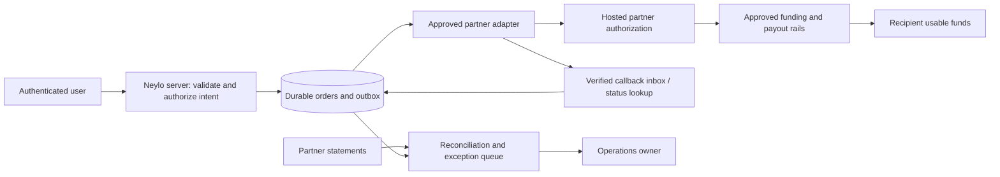

# Neylo payment integration guide

**Username directory update:** saved, self-declared receiving destinations now have a migration and authenticated APIs. `/pay` resolves exact handles and fills instructions automatically. This is not verified beneficiary enrollment or payment execution. Read [the feature and rollout guide](username-payments.md); its privacy model supersedes the old manual-only assumptions below.

**Audience:** bank/PSP technical, compliance and operations teams. **Status:** integration preparation; no approved or connected payment provider.

## Current surface

The public `/pay` journey prepares local bank instructions. It does not submit payments. Existing authenticated accounts reserve handles; handles are not payment destinations. Promotional fee credits are not customer money. The separate `ops/payment-sandbox` program is a local contract simulator, not a vendor sandbox.

`GET /api/payments/capabilities` is read-only, versioned and not cached:

```json
{
  "version": 1,
  "mode": "bank_instructions",
  "preparation": { "currency": "BAM", "minAmountMinor": 100, "maxAmountMinor": 10000 },
  "providerId": "not_connected",
  "domesticBamP2P": false,
  "funding": [],
  "payout": [],
  "recipientVerification": false,
  "execution": false
}
```

Preparation limits are product limits, not provider-approved transaction limits. There is no execution API, webhook receiver, bank credential collection or environment-variable switch that turns this planner into a payment service.

## Required partner answers

- Which legal entity contracts with Neylo, senders and recipients? Is a Bosnia-based Neylo approved for domestic BAM consumer P2P across the intended territories?
- Who controls customer funds, onboards users, handles sanctions/AML monitoring and reporting, resolves complaints and finances refunds/losses?
- Specify **funding and disbursement separately**. Can users authorize debit from their existing accounts? Which sending banks, receiving banks/card BINs and account types are covered?
- Is the recipient's usable destination a wallet or a bank account? Can a non-Neylo recipient receive? What identity verification and redemption are needed?
- What is production-available now: internal transfer, IPS, ordinary transfer or card payout? Provide cutoff, holiday, review and liquidity exceptions.
- Provide setup/minimum/per-leg/FX/refund/dispute fees, prefunding/reserves, sandbox credentials, certification checklist and production approval owners.

## Proposed execution boundary — not implemented



`PaymentProvider` in `provider.ts` is a small draft contract: authorization, status lookup and verified raw webhook decoding. It deliberately requires a verified recipient ID and a quote ID rather than accepting an arbitrary user-supplied bank account for execution. It is **not** a production SDK or evidence that a vendor has those exact endpoints. Extend only from the contracted provider's documentation: customer enrollment, recipient verification, quotes, refunds and statements remain to be implemented.

No provider tokens, secrets or raw bank credentials belong in browser code. A future hosted authorization URL must come from the server and pass an exact HTTPS origin allowlist. Redirect return parameters cannot confirm payment success. Provider customer tokens must be bound to the currently authenticated Neylo user, never supplied as arbitrary browser-selected identifiers.

## Data and money correctness

1. Store integer minor units with currency. Validate amount limits, recipient binding and unexpired server-side quote before creating an order. Obtain fresh user authorization for changes.
2. Persist an order, immutable request hash and outbox job in one database transaction. Scope idempotency keys to user and operation. A repeated key with changed input conflicts.
3. Send a stable partner reference. After an ambiguous timeout, query that reference. Never create a second payout or switch providers until the first outcome is resolved.
4. Verify raw callback bytes with the provider's specified signature, timestamp/key-rotation rules. Deduplicate events and validate order/reference, currency, amount and destination. Process inbox event plus state/ledger updates atomically.
5. Keep user-reported planner status separate from authoritative orders. No client, redirect or support toggle can set a bank-confirmed completion.
6. Define exactly what partner `completed` means. If it only means submitted or settled between institutions, retain a separate recipient-availability state. Design for returns, reversals and disputes after an earlier successful transfer.
7. Reconcile order events with statement entries and, where relevant, clearing balances and the double-entry ledger. Quarantine unmatched entries; do not silently write balancing adjustments.
8. For direct-bank execution, avoid inventing a Neylo customer wallet. For partner-held value, implement properly mapped liabilities, clearing and refund accounts, balanced immutable journals and locking around spend authorization.

## Delivery gates

| Gate | Required evidence | Current state |
|---|---|---|
| Commercial/legal | Approved Neylo use case, jurisdictions, contracts, responsibility matrix and cost sheet | Missing |
| Technical sandbox | Real provider credentials; onboarding → authorization → funding → recipient outcome → statement tested | Missing; local simulator only |
| Security | Threat model, account recovery, destination verification, least-privilege operator controls, penetration test, dependency review | Application tests exist; payment review outstanding |
| Operations | Named on-call owner, liquidity plan, daily reconciliations, incident/complaint/return procedures, service expectations | Guide only |
| Pilot | Agreed users/limits/exposure, production certification, rollback/disable plan, explicit live-money approval | Not activated |

## Partner certification scenarios

Require evidence for: duplicate submissions; changed payload on the same key; expired quote; unauthorized sender/customer token; changed beneficiary; double spending under concurrent requests; replayed/forged/out-of-order callbacks; lost acknowledgment; delayed success after timeout; failed payout after captured funding; duplicate refund; return after completion; unavailable bank; weekend liquidity exhaustion; stale statement; restored backup with replayed events; partner outage and termination/export.

Pass criteria: no duplicate money movement; zero unexplained journal imbalance; no client-created success; recoverable unknown outcomes; every pending/refund/return has an accountable owner. Recovery-time and recovery-point targets must be agreed for the actual durable system and tested before production.

## First integration implementation backlog

1. Approve legal/provider scope and capture an endpoint-by-endpoint capability matrix.
2. Add authenticated customer/verified-beneficiary enrollment with explicit consent, retention and deletion handling.
3. Add private orders/inbox/outbox/journal tables, constraints, RLS and restricted server mutations. Review migrations locally; do not reuse promotional-credit tables.
4. Implement one approved adapter, hosted authorization, callback verification and status recovery.
5. Implement statement reconciliation and support tooling with role separation and audited money-affecting actions.
6. Run certification and failure drills; price the complete flow, then conduct a limited live pilot under explicit approval.

This guide is a technical preparation package, not a claim that Neylo is licensed, bank-certified, production-integrated or ready to hold customer funds.
